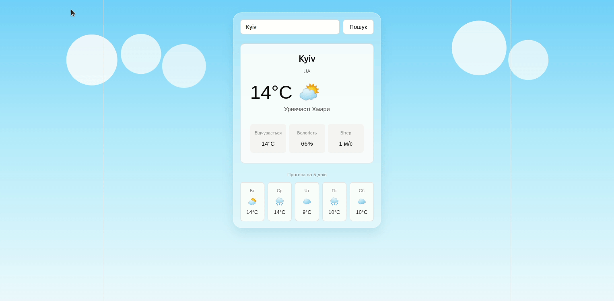

# Weather App

A simple weather application built with React, TypeScript, and Vite. The app allows users to search for a city and view the current weather plus a 5-day forecast.



## What I Used
- React
- TypeScript
- Vite
- CSS
- OpenWeather API for weather data
- React Hooks: `useState`, `useEffect`
- Custom React hooks
- Environment variables

## What I Learned
During this project, I practiced working with React Hooks such as `useState` and `useEffect`.

I used `useState` to manage user input, weather data, loading state, and error messages. I used `useEffect` to fetch weather data when the application loads and when the selected city changes.

I also learned how to connect a React application to an external API, work with TypeScript types and interfaces, create reusable components, and keep API keys outside of the source code using environment variables.

## Features
- Search weather by city name
- Current temperature, feels-like temperature, humidity, and wind speed
- 5-day forecast
- Weather icons based on weather conditions
- Loading and error states
- Responsive card-based UI

## Tech Stack
- React
- TypeScript
- Vite
- CSS
- OpenWeather API for weather data

## Getting Started
### 1. Clone the repository
```bash
git clone https://github.com/your-username/weather-app.git
cd weather-app
```
### 2. Install dependencies
```bash
npm install
```
### 3. Create an environment file
Create a `.env` file in the root of the project and add your OpenWeather API key:
```env
VITE_OPENWEATHER_API_KEY=your_api_key_here
```
You can use `.env.example` as a reference.

### 4. Run the project locally
```bash
npm run dev
```

### 5. Build for production
```bash
npm run build
```

## Scripts
```bash
npm run dev       # Start development server
npm run build     # Build production version
npm run lint      # Run ESLint
npm run preview   # Preview production build locally
```

## Project Structure

```text
weather-app/
├── demo/
│   └── demo.gif
├── public/
│   ├── favicon.svg
│   ├── icons.svg
│   └── images/
│       └── weather-bg.png
├── src/
│   ├── components/
│   │   ├── ForecastGrid.tsx
│   │   ├── SearchBar.tsx
│   │   └── WeatherCard.tsx
│   ├── hooks/
│   │   └── useWeather.ts
│   ├── types/
│   │   └── weather.types.ts
│   ├── App.tsx
│   ├── App.css
│   ├── index.css
│   └── main.tsx
├── .env.example
├── .gitignore
├── README.md
├── package.json
├── package-lock.json
├── tsconfig.json
└── vite.config.ts

## Environment Variables

| Variable | Description |
| --- | --- |
| `VITE_OPENWEATHER_API_KEY` | API key from OpenWeather |

## Notes

The `.env` file is ignored by Git and should not be committed to GitHub.
